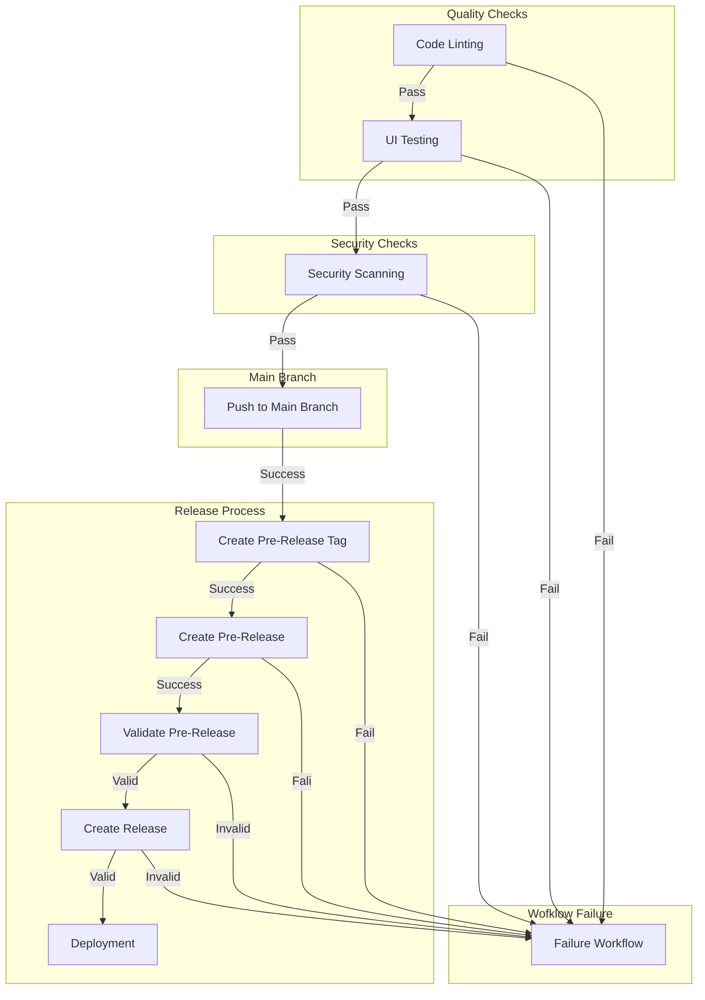

# Deploy Release

In this step will merge our pull request to run the workflows we have created on the previous steps.

1. Navgiate to the repository on GitHub and open the pull request.
2. Click on the button `Merge pull request` and select `Confirm merge`.
3. Navigate to the `Actions` tab and verify the workflows are running.
4. Check the tag was created on the repository.
5. Check the pre-release was created on the repository.
6. Check the release was created on the repository.
